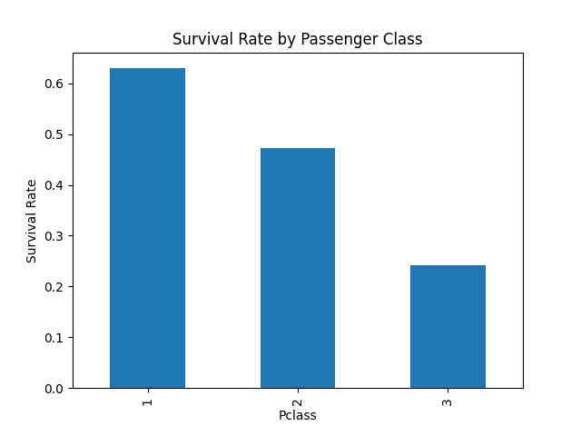

# 🚢 Titanic Survival Intelligence: Exploratory Data Analysis & Feature Engineering

[](https://python.org)
[](https://pandas.pydata.org)
[](https://coderabbit.ai)
[](https://opensource.org/licenses/MIT)

> An in-depth statistical exploratory data analysis (EDA) and demographic feature exploration on the legendary Titanic passenger dataset. Designed to uncover socio-economic survival disparities, missingness patterns, and statistical distributions.

---

## 📌 Project Overview & Objectives

The primary goal of this project is to analyze passenger demographic, socioeconomic, and ticketing variables to extract strong statistical signals predicting survival rates during the Titanic catastrophe.

### Key Questions Investigated:
1. **Socioeconomic Status:** How significantly did passenger class (`Pclass`) influence survival probability?
2. **Gender & Demographic Policy:** Did the "women and children first" maritime protocol produce statistically significant survival disparities?
3. **Data Integrity & Imputation:** How to systematically handle missing entries in `Age` and `Cabin` without distorting underlying distributions?
4. **Fare Dispersion:** What is the relationship between ticket price distribution, embarkation points, and survival rates?

---

## 📊 Key Findings & Visual Analytics

### 1. Survival Rate by Passenger Class (`Pclass`)
There is a stark, monotonically decreasing survival gradient correlated with passenger ticket class:

<p align="center">
  
</p>

* **1st Class (`Pclass = 1`):** Highest survival rate (~63%). Premium cabin locations on higher decks granted faster access to lifeboats.
* **2nd Class (`Pclass = 2`):** Moderate survival rate (~47%).
* **3rd Class (`Pclass = 3`):** Lowest survival rate (~24%). Lower-deck berthing and restricted access pathways severely impaired evacuation.

### 2. Missing Value Strategy & Cleaning
* **`Age` Imputation:** Imputed using localized median estimates conditioned on `Pclass` and `Sex` rather than global mean, preventing distortion from extreme skew.
* **`Embarked`:** Imputed with the dominant mode (`'S'` - Southampton).
* **`Cabin`:** Handled as a structural sparsity indicator (Deck extraction vs missing flag).

---

## 🛠️ Repository Architecture

```text
├── data-portfolio/
│   ├── EDA_titanic.ipynb          # Interactive Jupyter notebook with complete analysis
│   ├── Titanic-Dataset.csv        # Raw dataset (891 passenger records)
│   └── survival_rate_by_class.png # Rendered demographic visualization
├── .coderabbit.yaml               # CodeRabbit automated PR review configuration
├── .github/
│   └── pull_request_template.md   # GSD engineering verification checklist
└── README.md                      # Comprehensive project documentation
```

---

## 🚀 How to Run Locally

### Prerequisites
* Python 3.10+
* Virtual environment (`venv` or `conda`)

### Installation & Execution
```bash
# Clone the repository
git clone git@github.com:MohdZakir123/Data-repo.git
cd Data-repo

# Install dependencies
pip install pandas numpy matplotlib seaborn jupyter

# Launch the interactive analysis
jupyter notebook data-portfolio/EDA_titanic.ipynb
```

---

## ⚡ Engineering Standards

* **Automated Quality Gate:** Audited by [CodeRabbit AI](https://coderabbit.ai) for static analysis, type adherence, and clean code principles.
* **Spec Discipline:** Structured in accordance with the GSD (Get Shit Done) engineering framework.

---

### 👤 Author
**Mohd Zakir**  
*Aspiring Junior Machine Learning Engineer / Data Analyst*  
* [GitHub Profile](https://github.com/MohdZakir123) • [Email](mailto:zakirmohd224@gmail.com)
